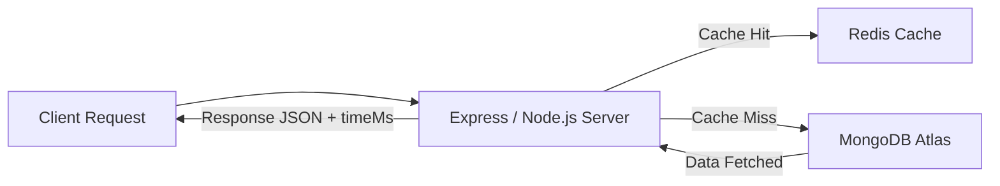

# Node.js + MongoDB + Redis — Agriculture Data Demo

This lab demonstrates how Redis caching can improve read performance for agricultural data stored in MongoDB. Students will compare latency between direct MongoDB reads and Redis-cached reads.

## 0. Install Redis

# Install Ubuntu in Windows
wsl --install -d Ubuntu
# Restart computer when prompted, then open Ubuntu terminal
sudo apt update
sudo apt install -y redis-server
sudo service redis-server start
redis-cli ping   # → PONG

brew update
brew install redis
brew services start redis
redis-cli ping   # → PONG

## 1. Overview
The server exposes two main GET endpoints:
- `/agriculture/mongo` — Reads documents directly from MongoDB  
- `/agriculture/redis` — Reads documents from Redis if available, or from MongoDB and then caches them  

Each endpoint returns a JSON response with timing information (`timeMs`), allowing direct comparison.

## 2. Setup Instructions
Clone the repository and install dependencies:
```bash
git clone https://github.com/SE4CPS/redis-mongo-agriculture.git
cd redis-mongo-agriculture
npm install
```
Create a `.env` file in the root directory:
```bash
PORT=3000
MONGO_HOST=mongodb+srv://cluster0.lixbqmp.mongodb.net
MONGO_USER=comp263_2025
MONGO_PASS=yourpassword
REDIS_URL=redis://localhost:6379
CACHE_TTL_SECONDS=60
```
Ensure MongoDB Atlas and Redis are accessible from your environment.

## 3. Running the Server
```bash
npm run dev
```
or
```bash
npm start
```
Expected console output:
```
Connected to cluster0.lixbqmp.mongodb.net
Redis connected: redis://localhost:6379
Server running at http://localhost:3000
```

## 4. API Endpoints
| Route | Description | Example Output |
|-------|--------------|----------------|
| `/agriculture/mongo` | Reads up to 500 records directly from MongoDB | `{ "source": "mongo", "timeMs": 234, "count": 500 }` |
| `/agriculture/redis` | Reads from Redis cache or populates cache on first call | `{ "source": "redis", "timeMs": 5, "count": 500 }` |
| `/agriculture/refresh` | Clears Redis cache keys for agriculture data | `{ "ok": true, "deletedKeys": 1 }` |
| `/health` | Shows MongoDB and Redis connection status | `{ "ok": true, "redis": "ready" }` |

## 5. Comparing Performance
Using curl:
```bash
curl -i http://localhost:3000/agriculture/mongo
curl -i http://localhost:3000/agriculture/redis
curl -i http://localhost:3000/agriculture/redis   # second request = cache hit
```
Optional load testing:
```bash
npx autocannon -c 20 -d 10 http://localhost:3000/agriculture/mongo
npx autocannon -c 20 -d 10 http://localhost:3000/agriculture/redis
```
Redis responses should be much faster on repeated calls.

## 6. Code Summary
- **MongoDB connection:** Uses `.env` credentials and Atlas SRV URI  
- **Redis client:** Uses `ioredis` with TTL (`CACHE_TTL_SECONDS`)  
- **Timing:** Each response includes `timeMs` and sets the `X-Response-Time` header  
- **Goal:** Demonstrate latency difference between cached and uncached reads  

## 7. Lab Exercises
1. Add query parameters such as `?crop=rice` and include them in the cache key  
2. Test different cache TTLs (10s, 120s) and measure latency  
3. Add console logs for cache hits and misses  
4. Extend with `/agriculture/:id` for per-document caching  
5. Visualize `timeMs` data in a bar chart  

## 8. Learning Outcomes
- Understand how Redis acts as an in-memory cache for read-heavy workloads  
- Measure latency and throughput differences between MongoDB and Redis  
- Implement cache invalidation and TTL strategies  
- Apply caching principles in data engineering and IoT contexts  

## 9. System Architecture Diagram


## 10. Author and Course Context
**Author:** Dr. Berhe  
**Course:** COMP-263
**Institution:** University of the Pacific  
